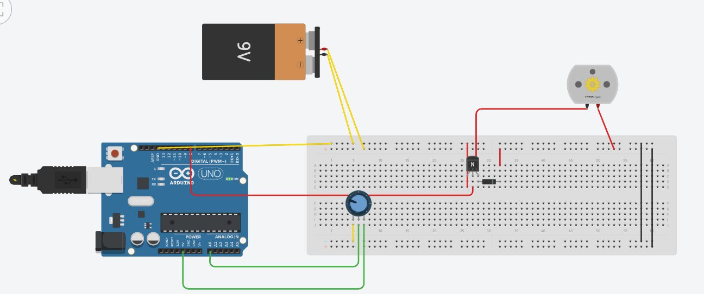

# Hız Motoru Arduino

Bu proje, bir Arduino kartı kullanarak bir DC motorun hızını kontrol etmeyi amaçlar. Motorun hızı, bir potansiyometre aracılığıyla ayarlanabilir.

## Gerekli Malzemeler

* Arduino kartı (Örneğin, Arduino Uno)
* DC motor
* Transistör (Örneğin, NPN transistör)
* Potansiyometre
* Bağlantı kabloları
* Breadboard (İsteğe bağlı)

## Bağlantı Şeması

1. **Motor:** Motorun bir ucunu transistörün kollektör ucuna, diğer ucunu ise güç kaynağının pozitif ucuna bağlayın.
2. **Transistör:** Transistörün beyz ucunu Arduino'nun 8 numaralı pinine, emetör ucunu ise güç kaynağının negatif ucuna bağlayın.
3. **Potansiyometre:** Potansiyometrenin bir ucunu Arduino'nun A0 pinine, diğer ucunu güç kaynağının pozitif ucuna, orta ucunu ise güç kaynağının negatif ucuna bağlayın.
	


## Kod

```c++
int transistor = 8; // Transistörü 8. pine bağladık.
int hiz; // Hız değeri tanımladık.

void setup() {
  pinMode(transistor, OUTPUT); // 8. pinden çıkış verdik.
  pinMode(A0, INPUT); // A0'a giriş verdik.
}

void loop() {
  hiz = analogRead(A0); // A0 pinindeki bilgiye göre hız değişkeninin değerini bulduk.
  analogWrite(transistor, hiz); // Hız değerine göre motoru çalıştırdık.
}
Çalıştırma
Arduino kartınızı bilgisayara bağlayın.
Kodu Arduino IDE'sine yükleyin.
Potansiyometreyi çevirerek motorun hızını ayarlayın.
Açıklama
analogRead(A0): A0 pinindeki analog değeri okur (0-1023 arasında bir değer).
analogWrite(transistor, hiz): Transistörün beyz ucuna, hiz değişkeninin değerine göre bir PWM sinyali gönderir. Bu sinyal, motorun hızını kontrol eder.
